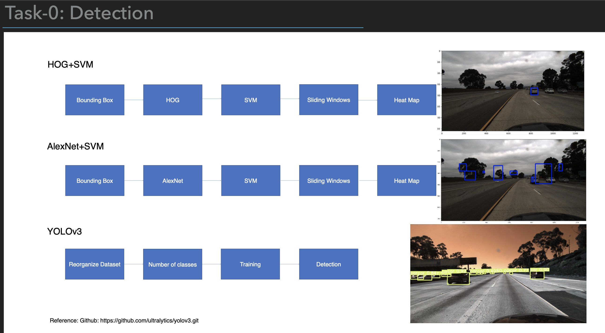
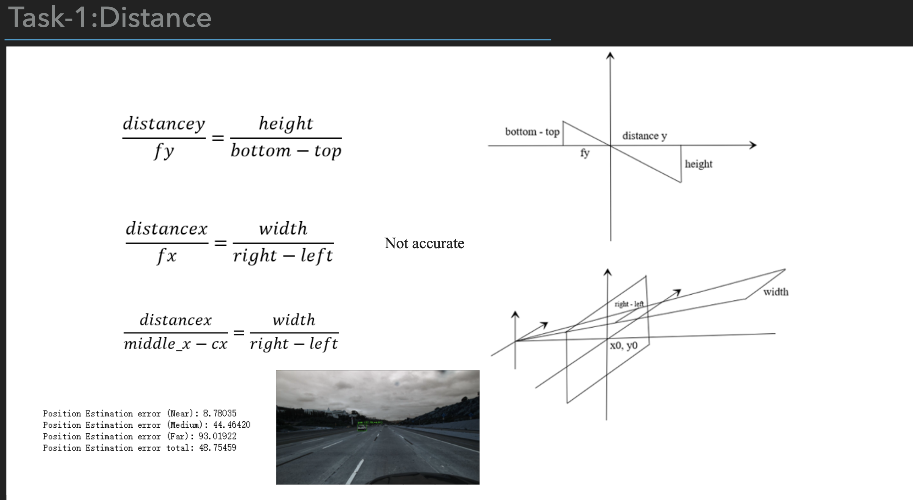
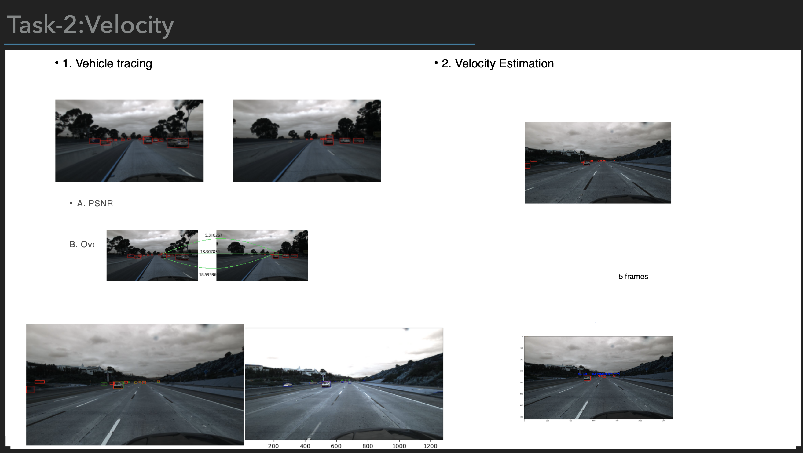
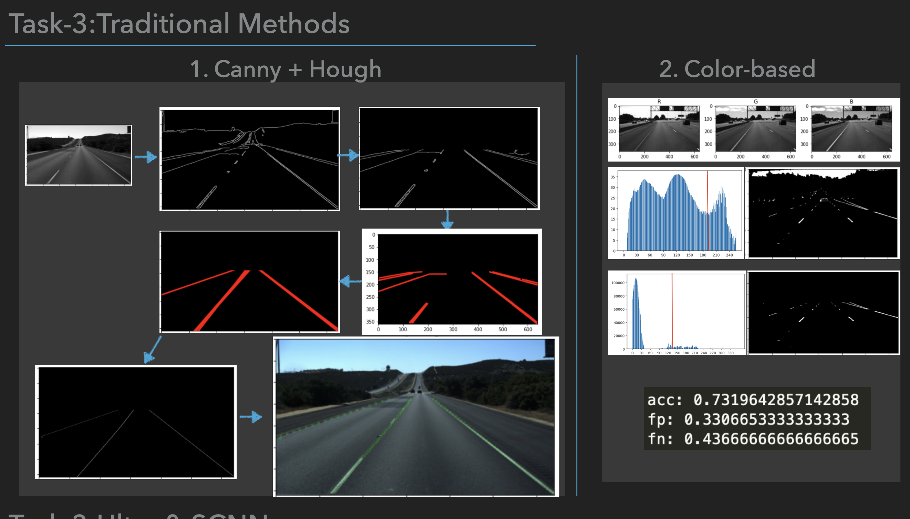

[TOC]

# 车辆自动驾驶
## 车辆检测（共实现3个版本：1.SVM+HOG|2.AlexNet+SVM|3.YOLOv3）

## 车距检测

## 车速检测

## 车道检测（共实现3种：1.传统方法｜2.Ultra｜3.SCNN）

## demo展示（Ultra）
因为本人负责的部分是Ultra，所以这里仅展示Ultra
<iframe src="//player.bilibili.com/player.html?aid=503997160&bvid=BV18g411u71a&cid=361851741&page=1" scrolling="no" border="0" frameborder="no" framespacing="0" allowfullscreen="true"> </iframe>
